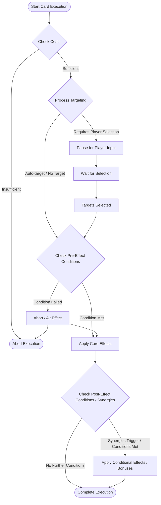
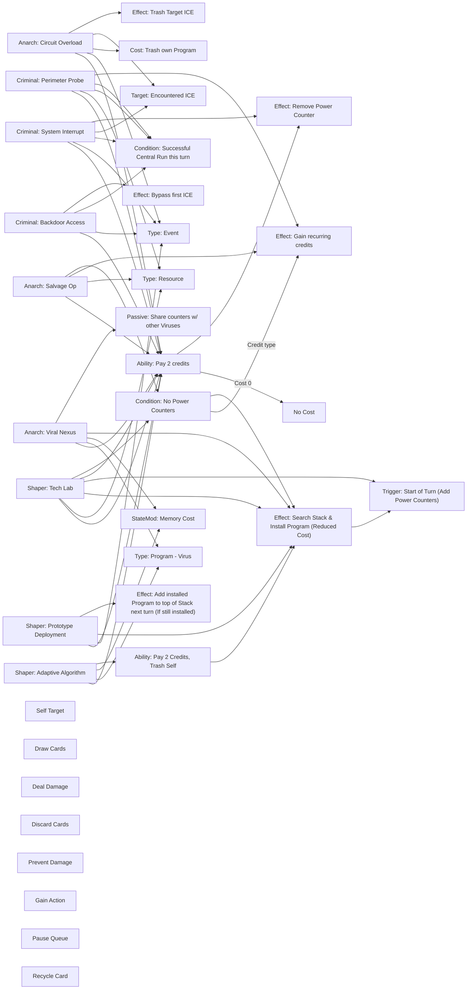

# Card Component System Architecture

This document visualizes the relationships between card mechanics, keywords, and components in our Cyberpunk deck-builder game.

## Component Type Hierarchy

```mermaid
# Card Component System Architecture (Runner Focused)

This document visualizes the relationships between card mechanics, keywords, and components for the Runner factions in our Cyberpunk deck-builder game scenario mode.

## Component Type Hierarchy

```mermaid
classDiagram
    Component <|-- TargetingComponent
    Component <|-- CostComponent
    Component <|-- EffectComponent
    Component <|-- ConditionalComponent
    Component <|-- ControlFlowComponent
    Component <|-- InformationComponent
    Component <|-- StateModificationComponent

    TargetingComponent <|-- SingleEntityTarget
    TargetingComponent <|-- MultiEntityTarget
    TargetingComponent <|-- SelfTarget
    TargetingComponent <|-- LocationTarget -- Specific server, heap, stack etc.

    CostComponent <|-- CreditCost
    CostComponent <|-- ActionCost
    CostComponent <|-- TrashCost -- Trash own card as cost
    CostComponent <|-- HealthCost -- Take damage as cost
    CostComponent <|-- KeywordRequirement

    EffectComponent <|-- GainCredits
    EffectComponent <|-- DealDamage -- Net, Meat, Brain
    EffectComponent <|-- PreventDamage
    EffectComponent <|-- DrawCards
    EffectComponent <|-- DiscardCards -- Self or Opponent (Corp context placeholder)
    EffectComponent <|-- GainAction
    EffectComponent <|-- InstallCard -- Programs, Hardware, Resources
    EffectComponent <|-- TrashTargetCard -- Trash ICE, Assets etc.
    EffectComponent <|-- BypassSecurity -- Bypass ICE, skip traces etc.
    EffectComponent <|-- RecycleCard -- Recover from Heap
    EffectComponent <|-- AddCounters -- Virus, Power etc.
    EffectComponent <|-- ModifyTarget -- Boost program, change ICE state

    ConditionalComponent <|-- KeywordSynergy
    ConditionalComponent <|-- FactionSynergy
    ConditionalComponent <|-- RunCondition -- Based on run success, location etc.
    ConditionalComponent <|-- ResourceThreshold -- Based on credits, cards in hand etc.
    ConditionalComponent <|-- RiskReward -- Chance-based outcomes

    ControlFlowComponent <|-- PauseQueue
    ControlFlowComponent <|-- CancelCard -- Cancel own or opponent effect (Corp context placeholder)
    ControlFlowComponent <|-- RedirectEffect
    ControlFlowComponent <|-- ChainEffect -- Trigger another effect/card

    InformationComponent <|-- RevealCard
    InformationComponent <|-- ScanEntity
    InformationComponent <|-- PeekLocation -- Look at top of R&D, HQ etc. (Corp context placeholder)

    StateModificationComponent <|-- IncreaseMemory
    StateModificationComponent <|-- ModifyAttribute -- Change program strength, hand size limit etc.
    StateModificationComponent <|-- AddTag -- (Primarily Corp effect, but Runners interact)


    class Component {
        +type: string
        +apply(context: GameContext): boolean // Returns true if execution should pause
    }

    class TargetingComponent {
        <<abstract>>
    }

    class CostComponent {
        <<abstract>>
        +canPay(context: GameContext): boolean
        +payCost(context: GameContext): void
    }

    class EffectComponent {
        <<abstract>>
    }

    class ConditionalComponent {
        <<abstract>>
        +checkCondition(context: GameContext): boolean
        +applyModification(effectComponent: EffectComponent, context: GameContext): void
    }

    class ControlFlowComponent {
        <<abstract>>
    }

    class InformationComponent {
        <<abstract>>
    }

    class StateModificationComponent {
         <<abstract>>
    }

    class GainCredits {
        +amount: number | string // Can be fixed or variable (e.g., 'X')
    }

    class DealDamage {
        +amount: number
        +damageType: string // Net, Meat, Brain
    }

    class BypassSecurity {
      +targetType: string // ICE, Trace, etc.
    }

    class RecycleCard {
        +sourceLocation: string // Heap
        +targetLocation: string // Hand, Stack
        +filter?: function // Filter by card type, keyword etc.
    }

    class AddCounters {
        +counterType: string // Virus, Power, etc.
        +amount: number
    }

    class ModifyTarget {
      +attribute: string // Strength, RezCost etc.
      +delta: number // Change amount
      +duration: string // Remainder of run, permanent etc.
    }

    class IncreaseMemory {
      +amount: number
    }

    class TrashCost {
        +targetFilter: function // e.g., 'an installed program'
        +count: number
    }

    class HealthCost {
        +amount: number
        +damageType: string // Usually Meat or Brain
    }

    class RunCondition {
        +conditionType: string // SuccessfulRun, AccessedServer, EncounteredICE, etc.
        +server?: string // Optional server filter
    }

    class RiskReward {
        +successChance: number // 0-1
        +successEffect: EffectComponent
        +failureEffect?: EffectComponent
    }
```

## Card Execution Flow



## Keyword Synergy Network

```mermaid
graph TB
    %% Runner Faction nodes
    Anarch[Anarch - Red]
    Criminal[Criminal - Blue]
    Shaper[Shaper - Green]

    %% Keyword nodes
    Virus[Keyword: Virus]
    Stealth[Keyword: Stealth]
    Connection[Keyword: Connection]
    Program[Keyword: Program]
    Hardware[Keyword: Hardware]
    Mod[Keyword: Mod]
    Breaker[Keyword: Breaker]
    Resource[Keyword: Resource]
    Event[Keyword: Event]
    Damage[Keyword: Damage (Self-inflicted)]
    Trash[Keyword: Trash (Self)]

    %% Effect Component nodes (Simplified)
    DealDamage[Effect: Deal Damage]
    PreventDamage[Effect: Prevent Damage]
    DrawCards[Effect: Draw Cards]
    GainCredits[Effect: Gain Credits]
    DiscardCards[Effect: Discard Cards]
    CancelCard[Effect: Cancel Card]
    Bypass[Effect: Bypass Security]
    Install[Effect: Install Card]
    Boost[Effect: Boost Program]
    Recycle[Effect: Recycle Card]
    Destroy[Effect: Destroy Target Card]

    %% Faction to Keyword connections
    Anarch --- Virus
    Anarch --- Damage
    Anarch --- Trash
    Anarch --- Breaker
    Anarch --- Event

    Criminal --- Stealth
    Criminal --- Connection
    Criminal --- Resource
    Criminal --- Event
    Criminal --- Program

    Shaper --- Program
    Shaper --- Hardware
    Shaper --- Mod
    Shaper --- Breaker
    Shaper --- Resource

    %% Keyword to Effect connections
    Virus ==> |Enhances| DealDamage
    Virus ==> |Enables| DiscardCards
    Virus ==> |Synergy with| AddCounters[Effect: Add Counters]

    Stealth ==> |Enables| Bypass
    Stealth ==> |Enables| CancelCard
    Stealth ==> |Enhances| GainCredits

    Connection ==> |Enhances| GainCredits
    Connection ==> |Enables| InformationComponent[Info: Peek/Scan]
    Connection ==> |Enables| Bypass

    Program ==> |Enables| Boost
    Program ==> |Enables| Install
    Program ==> |Enables| Breaker

    Hardware ==> |Enables| Install
    Hardware ==> |Enhances| StateModificationComponent[StateMod: IncreaseMemory]
    Hardware ==> |Enhances| GainCredits

    Mod ==> |Enables| Boost
    Mod ==> |Enables| ModifyTarget[Effect: Modify Target]
    Mod ==> |Synergy with| Install

    Breaker ==> |Enables| Bypass
    Breaker ==> |Enables| Destroy

    Damage ==> |Cost for| DealDamage
    Damage ==> |Cost for| Destroy
    Damage ==> |RiskReward Component| GainCredits

    Trash ==> |Cost for| Recycle
    Trash ==> |Cost for| Destroy
    Trash ==> |Cost for| GainCredits
```

## Component Usage in Cards



## Text-to-Component Mapping Process

```mermaid
flowchart TB
    CardText[Card Text] --> ParseText[Parse Text for Keywords & Phrases]
    ParseText --> IdentifyComponents{Identify Components & Parameters}

    IdentifyComponents -- "Cost Phrase (e.g., 'Cost: 2 Credits')" --> CostComponentGen[Generate Cost Components]
    IdentifyComponents -- "Targeting Phrase (e.g., 'target an installed program')" --> TargetingComponentGen[Generate Targeting Components]
    IdentifyComponents -- "Action Phrase (e.g., 'Gain 3 credits', 'bypass it')" --> EffectComponentGen[Generate Effect Components]
    IdentifyComponents -- "Conditional Phrase (e.g., 'If you made a run...', 'For each virus counter...')" --> ConditionalComponentGen[Generate Conditional Components]
    IdentifyComponents -- "Control Phrase (e.g., 'instead of accessing cards', 'end the run')" --> ControlFlowComponentGen[Generate Control Flow Components]
    IdentifyComponents -- "State Phrase (e.g., '+1 Memory', 'gets +1 strength')" --> StateModComponentGen[Generate State Modification Components]

    CostComponentGen --> ComponentList[Append to Component List]
    TargetingComponentGen --> ComponentList
    EffectComponentGen --> ComponentList
    ConditionalComponentGen --> ComponentList
    ControlFlowComponentGen --> ComponentList
    StateModComponentGen --> ComponentList

    ComponentList --> SequenceComponents[Sequence Components based on Execution Order Rules]
    SequenceComponents --> ResolveContext[Resolve Contextual Dependencies (e.g., Synergy targets)]
    ResolveContext --> AttachToCard[Attach Component List to Card]
    AttachToCard --> EnhancedCard[Enhanced Card with Components]

```