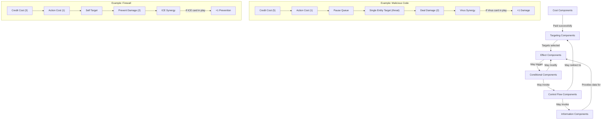
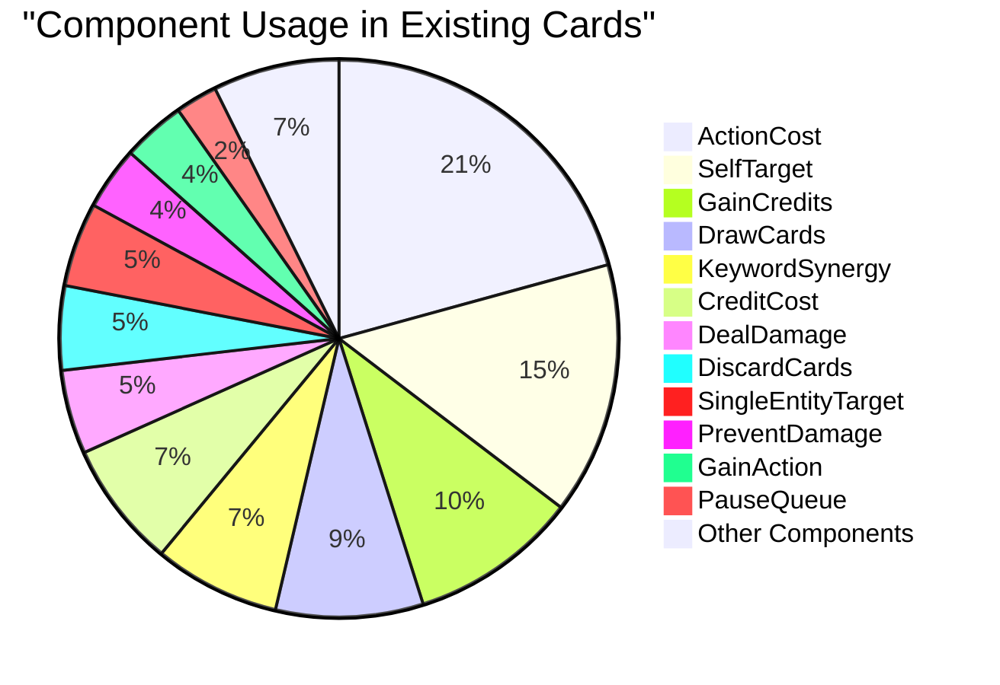
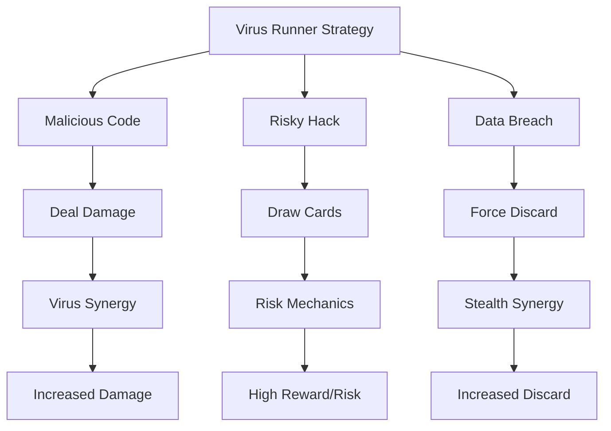
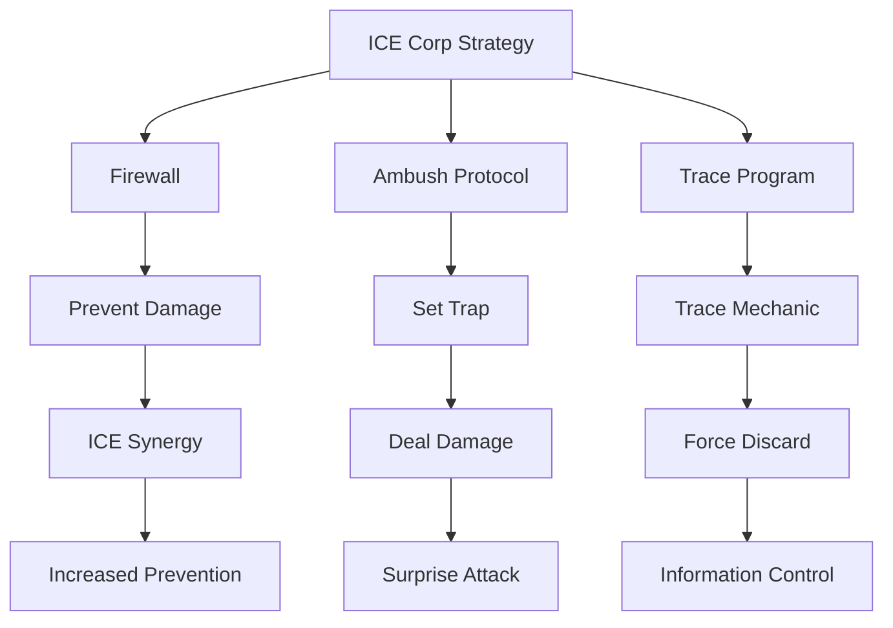
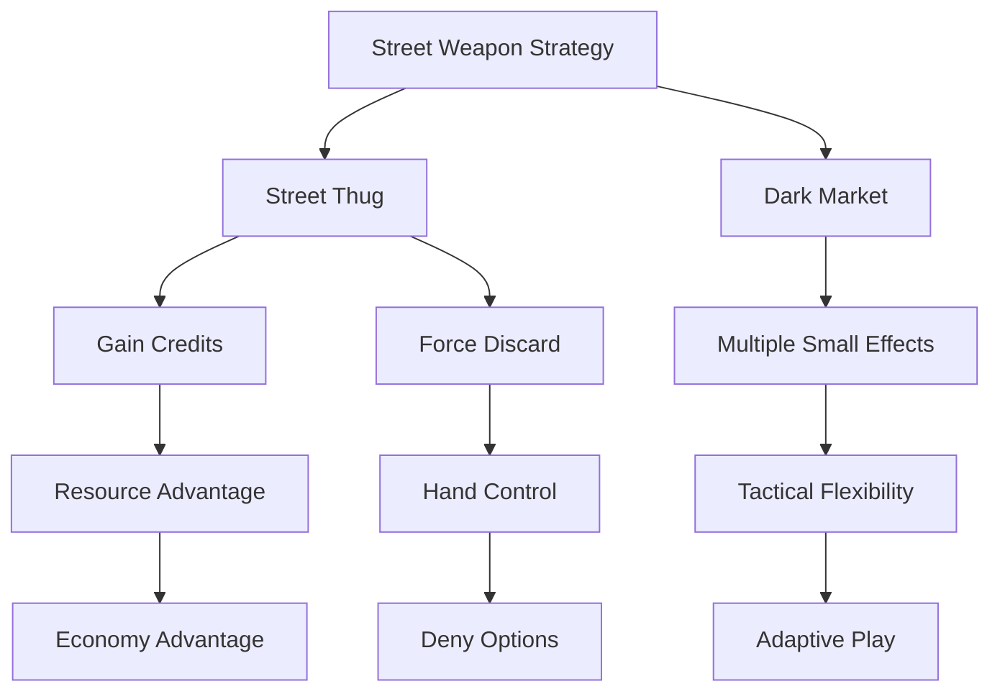
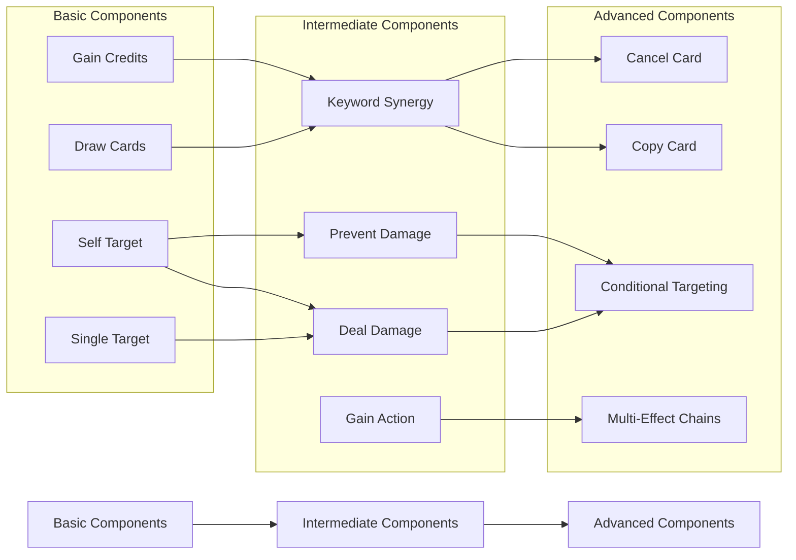

# Component Relationship Matrix

This document visualizes the relationships between components, keywords, factions, and game mechanics in our Cyberpunk deck-builder.

## Component-Keyword Relationship Matrix

| Component        | Virus       | ICE          | Stealth       | Memory      | Hardware    | Program     | Cyberware    | Weapon      |
|------------------|-------------|--------------|---------------|-------------|-------------|-------------|--------------|-------------|
| GainCredits      | -           | -            | -             | -           | ✓✓          | ✓           | -            | -           |
| DealDamage       | ✓✓✓         | -            | ✓             | -           | -           | -           | -            | ✓✓          |
| PreventDamage    | -           | ✓✓✓          | ✓             | -           | ✓           | -           | ✓            | -           |
| DrawCards        | ✓           | -            | ✓             | ✓✓✓         | -           | ✓           | ✓✓           | -           |
| DiscardCards     | ✓           | -            | ✓✓✓           | -           | -           | -           | -            | ✓           |
| GainAction       | -           | -            | ✓             | ✓✓          | -           | ✓           | ✓            | -           |
| CopyCard         | ✓           | -            | -             | ✓           | -           | -           | ✓✓✓          | -           |
| CancelCard       | ✓           | ✓            | ✓✓✓           | -           | -           | ✓           | -            | -           |
| RevealCard       | ✓✓          | -            | ✓✓            | -           | -           | -           | -            | -           |
| ScanEntity       | -           | ✓✓           | ✓             | ✓✓          | ✓           | -           | -            | -           |

Legend:
- ✓: Minor synergy
- ✓✓: Medium synergy
- ✓✓✓: Strong synergy

## Faction-Component Affinity

| Component        | Runner      | Corp         | Street        |
|------------------|-------------|--------------|---------------|
| GainCredits      | ✓✓          | ✓✓✓          | ✓             |
| DealDamage       | ✓✓          | ✓            | ✓✓✓           |
| PreventDamage    | ✓           | ✓✓✓          | ✓             |
| DrawCards        | ✓✓✓         | ✓✓           | ✓             |
| DiscardCards     | ✓✓          | ✓            | ✓✓✓           |
| GainAction       | ✓✓✓         | ✓            | ✓✓            |
| CopyCard         | ✓✓          | ✓✓           | ✓             |
| CancelCard       | ✓✓✓         | ✓✓           | ✓             |
| RevealCard       | ✓✓✓         | ✓            | ✓✓            |
| ScanEntity       | ✓✓          | ✓✓✓          | ✓             |

## Component Interaction Diagram

## Component Usage Frequency in Cards

## Strategy Archetypes and Component Relationships

### Virus Runner Archetype

Focus on virus proliferation and damage dealing with a secondary focus on card draw.

### ICE Corp Archetype

Focus on defense, prevention, and control with information gathering.

### Street Weapon Archetype

Focus on direct damage and resource control.

## Component Progression Flow

How components typically build on each other in card design:

