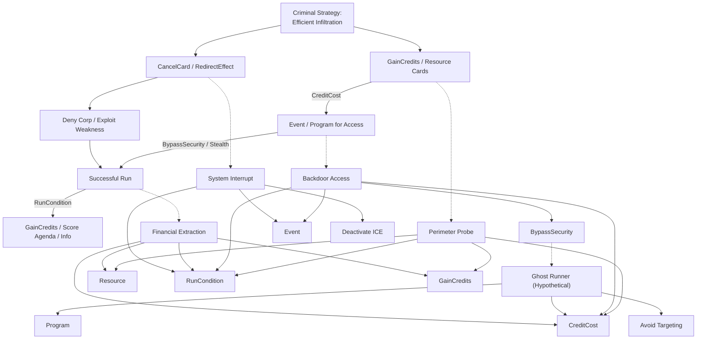
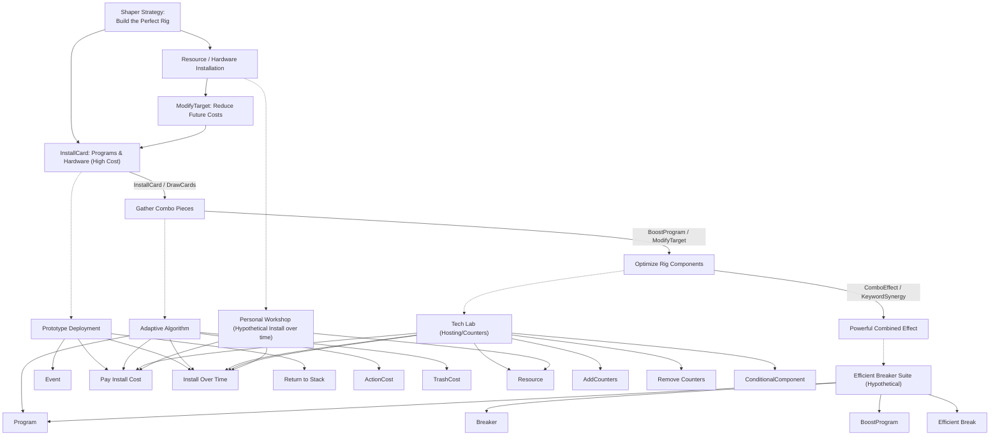
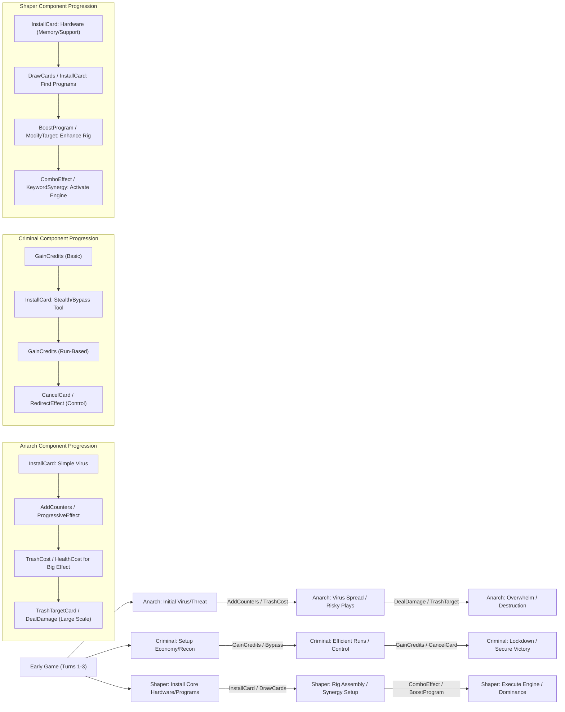

# Component Relationship Matrix (Runner Focused)

This document visualizes the relationships between components, keywords, factions, and game mechanics for the Runner factions in our Cyberpunk deck-builder scenario mode.

## Runner Faction Identity Mechanics Matrix

| Faction           | Core Identity                                     | Primary Mechanics (Components/Concepts)                                  | Secondary Mechanics (Components/Concepts)                             | Risk Profile                | Vulnerabilities         |
|-------------------|---------------------------------------------------|--------------------------------------------------------------------------|-----------------------------------------------------------------------|-----------------------------|-------------------------|
| **Anarch (Red)**  | Destructive, recycle, high-risk/high-reward, chaos | `DealDamage`, `TrashCost` (Self), `RiskReward`, `AddCounters` (Virus)    | `TrashTargetCard`, `RecycleCard`, `HealthCost`, `ProgressiveEffect` | High Risk, High Reward    | Self-Damage, Meat Damage, Unpredictability |
| **Criminal (Blue)** | Efficient, stealthy, flexible, resourceful fixer  | `GainCredits`, `BypassSecurity`, `CancelCard`, `Event` (Efficiency)      | `RedirectEffect`, `GainAction`, `Connection` (Keyword), `Stealth` (Keyword) | Medium Risk, Consistent Reward | Tags, Traces, High Credit Costs |
| **Shaper (Green)** | Builder, engineer, combo-focused, slow setup      | `InstallCard`, `BoostProgram`, `ComboEffect`, `StateModificationComponent` | `DrawCards`, `ModifyTarget`, `Program` (Keyword), `Hardware` (Keyword)  | Low Risk, Delayed High Reward | Setup Time, Resource Intensive, Direct Damage |

## Component-Keyword Relationship Matrix by Runner Faction

*(✓ = Related, ✓✓ = Strongly Related, ✓✓✓ = Core Synergy)*

### Anarch Keywords

| Component         | Virus | Damage (Self) | Trash (Self) | Breaker (Anarch Style) | Event (Anarch Style) |
|-------------------|-------|---------------|--------------|------------------------|----------------------|
| DealDamage        | ✓✓✓   | ✓✓            | ✓            | ✓                      | ✓✓                   |
| TrashTargetCard   | ✓✓    | ✓             | ✓✓           | ✓✓✓                    | ✓                    |
| TrashCost         | ✓     | ✓✓✓           | ✓✓✓          | ✓✓                     | ✓✓                   |
| HealthCost        | ✓     | ✓✓✓           | ✓            | ✓                      | ✓                    |
| RiskReward        | ✓✓    | ✓✓✓           | ✓✓           | ✓                      | ✓✓                   |
| RecycleCard       | ✓     | ✓✓            | ✓✓✓          | -                      | ✓                    |
| AddCounters       | ✓✓✓   | -             | ✓            | -                      | ✓                    |
| ProgressiveEffect | ✓✓✓   | -             | -            | -                      | -                    |

### Criminal Keywords

| Component      | Stealth | Connection | Resource (Criminal Style) | Event (Criminal Style) | Program (Criminal Style) |
|----------------|---------|------------|---------------------------|------------------------|--------------------------|
| GainCredits    | ✓✓      | ✓✓✓        | ✓✓✓                       | ✓✓✓                    | ✓✓                       |
| BypassSecurity | ✓✓✓     | ✓✓         | ✓                         | ✓✓✓                    | ✓✓                       |
| CancelCard     | ✓✓      | ✓          | ✓                         | ✓✓                     | ✓                        |
| RedirectEffect | ✓✓      | ✓✓         | ✓                         | ✓✓                     | ✓✓                       |
| GainAction     | ✓✓      | ✓✓         | ✓✓                        | ✓✓✓                    | ✓                        |
| Peek/Scan      | ✓       | ✓✓✓        | ✓                         | ✓                      | ✓                        |
| AddTag (Self)  | *Risk*  | *Risk*     | -                         | *Risk*                 | -                        |

### Shaper Keywords

| Component                | Program | Hardware | Mod   | Breaker (Shaper Style) | Resource (Shaper Style) |
|--------------------------|---------|----------|-------|------------------------|-------------------------|
| InstallCard              | ✓✓✓     | ✓✓✓      | ✓✓    | ✓✓                     | ✓✓                      |
| BoostProgram             | ✓✓✓     | ✓        | ✓✓✓   | ✓✓✓                    | ✓                       |
| ModifyTarget             | ✓✓✓     | ✓✓       | ✓✓✓   | ✓✓                     | ✓                       |
| ComboEffect              | ✓✓✓     | ✓✓       | ✓✓✓   | ✓✓                     | ✓                       |
| DrawCards                | ✓✓      | ✓✓       | ✓✓    | ✓                      | ✓✓✓                     |
| StateModificationComponent | ✓✓✓     | ✓✓✓      | ✓✓    | ✓✓                     | ✓✓                      |
| PreventDamage            | ✓       | ✓        | ✓     | ✓✓                     | ✓                       |
| CreditCost (High Initial)| ✓✓      | ✓✓       | ✓✓    | ✓                      | ✓                       |
| ActionCost (High Initial)| ✓✓      | ✓✓       | ✓✓    | ✓                      | ✓                       |

## Faction-Component Risk/Reward Profile (Runner Perspective)

| Component Type             | Anarch (Red)                    | Criminal (Blue)                       | Shaper (Green)                     |
|----------------------------|---------------------------------|---------------------------------------|------------------------------------|
| **Cost Components**        |                                 |                                       |                                    |
| CreditCost                 | Medium (Prefers other costs)    | High (Accepts high cost for efficiency) | Medium-High (Expensive setup)      |
| ActionCost                 | Medium                          | Low (Values action efficiency)        | High (Accepts setup time)          |
| TrashCost (Self)           | Low (Core mechanic, high value) | High (Avoids losing resources)        | Medium (If part of upgrade/combo)  |
| HealthCost (Self)          | Low (Core mechanic, high value) | Very High (Avoids direct harm)        | Very High (Avoids direct harm)     |
| **Effect Components**      |                                 |                                       |                                    |
| DealDamage (to Corp/ICE)   | Low (High value, core strategy) | Medium (Situational)                  | High (Prefers bypass/building)     |
| GainCredits                | Medium-High (Less efficient)    | Low (High value, core strategy)       | Medium (Builds own economy slowly) |
| DrawCards                  | Medium                          | Medium (Flexibility)                  | Low (High value, combo setup)      |
| InstallCard                | High (Less structure)           | Medium (Installs tools)               | Low (High value, core strategy)    |
| BypassSecurity             | Medium-High (Prefers breaking)  | Low (High value, core strategy)       | Medium (Prefers efficient breakers)|
| TrashTargetCard (e.g. ICE) | Low (High value, core strategy) | High (Prefers bypass/manipulation)    | Medium (If efficient/part of combo)|
| **Control Components**     |                                 |                                       |                                    |
| CancelCard                 | High (Less subtle)              | Low (High value, core strategy)       | Medium (Technical solutions)       |
| RedirectEffect             | Medium (If chaotic)             | Low (High value, control strategy)    | High (Less direct manipulation)    |
| ModifyTarget               | Medium (Viruses weakening ICE)  | Medium (Situational tools)            | Low (High value, core strategy)    |

Legend:
- Cost Components: Low = Faction considers it cheap/acceptable, High = Faction considers it expensive/undesirable.
- Effect/Control Components: Low = High value/efficiency for faction, High = Low value/efficiency for faction.

## Component Interaction Diagram: Runner Faction Play Patterns

```mermaid
flowchart TD
    %% Component Categories by Faction
    AnarchCost["Anarch Costs\n(TrashSelf, Health, Risk)"]
    CriminalCost["Criminal Costs\n(Credits, Actions, Tags)"]
    ShaperCost["Shaper Costs\n(Time, Setup Credits/Actions)"]

    AnarchEffect["Anarch Effects\n(Destroy, Damage, Virus)"]
    CriminalEffect["Criminal Effects\n(GainCredits, Bypass, Cancel)"]
    ShaperEffect["Shaper Effects\n(Install, Boost, Combo)"]

    %% Main execution flow by faction
    AnarchCost --> |"Fuel Chaos"| AnarchEffect
    AnarchEffect --> |"Destabilize"| GameState1["Weakened Corp Defenses / Volatile State"]
    GameState1 --> |"Exploit Weakness"| AnarchAdvantage["Anarch Breakthrough"]

    CriminalCost --> |"Invest Efficiently"| CriminalEffect
    CriminalEffect --> |"Gain Advantage"| GameState2["Resource Lead / Access Opportunity"]
    GameState2 --> |"Execute Precisely"| CriminalAdvantage["Criminal Score / Control"]

    ShaperCost --> |"Build Foundation"| ShaperEffect
    ShaperEffect --> |"Assemble Engine"| GameState3["Powerful Rig / Combo Ready"]
    GameState3 --> |"Overwhelm"| ShaperAdvantage["Shaper Dominance"]

    %% Example component execution flows by faction
    subgraph "Anarch Pattern: Burn & Recycle"
        TrashProgram["TrashCost: Own Program"] --> DestroyICE["TrashTargetCard: ICE"]
        DestroyICE --> RecycleBenefit["RecycleCard / Gain Benefit from Trash"]
        RecycleBenefit --> DamageOrAccess["DealDamage / Access Server"]
    end

    subgraph "Criminal Pattern: Run & Profit"
        GainMoney["GainCredits"] --> PayForTool["CreditCost: Pay for Event/Program"]
        PayForTool --> BypassICE["BypassSecurity: ICE"]
        BypassICE --> SuccessfulRun["RunCondition: Successful Run"] --> GainMoreMoney["GainCredits / Access"]
    end

    subgraph "Shaper Pattern: Build & Combo"
        InstallProgram["InstallCard: Program (High Cost)"] --> InstallHardware["InstallCard: Hardware"]
        InstallHardware --> BoostComponents["BoostProgram / ModifyTarget"]
        BoostComponents --> ComboTrigger["ComboEffect: Trigger Powerful Action"]
    end
```



Runner Faction Archetypes: Component Strategy Maps

```
Anarch (Red): Virus Saboteur
High-risk, destruction-focused strategy using viruses and self-sacrifice.
graph TD
    AnarchStrategy["Anarch Strategy:\nBurn It Down"] --> VirusVector["InstallCard: Virus Programs"]
    VirusVector -- AddCounters --> ViralGrowth["ProgressiveEffect: Grow Virus Counters"]
    ViralGrowth -- KeywordSynergy --> ViralExplosion["DealDamage / TrashTargetCard (Virus Synergy)"]

    AnarchStrategy --> RiskyPlay["RiskReward / HealthCost / TrashCost"]
    RiskyPlay --> PowerfulEffect["DealDamage / TrashTargetCard (High Impact)"]
    PowerfulEffect --> RecycleGain["RecycleCard / Gain Benefit from Destruction"]

    %% Key cards and components (Examples)
    VirusVector -.-> DataCorruptor["Data Corruptor"]
    ViralGrowth -.-> ViralNexus["Viral Nexus"]
    ViralExplosion -.-> CircuitOverload["Circuit Overload"]
    RiskyPlay -.-> BruteForce["Brute Force (Hypothetical)"]
    RecycleGain -.-> Scrapheap["Scrapheap"]

    %% Components Used
    DataCorruptor --> InstallCard; DataCorruptor --> AddCounters; DataCorruptor --> ModifyTarget
    ViralNexus --> InstallCard; ViralNexus --> AddCounters; ViralNexus --> KeywordSynergy
    CircuitOverload --> Event; CircuitOverload --> CreditCost; CircuitOverload --> TrashCost; CircuitOverload --> TrashTargetCard
    BruteForce --> Event; BruteForce --> CreditCost; BruteForce --> HealthCost; BruteForce --> BypassSecurity["Break Subroutines"]
    Scrapheap --> Resource; Scrapheap --> AddCounters["Trigger: On Trash"]; Scrapheap --> GainCredits
```

Criminal (Blue): Stealth Infiltrator
Efficient, control-focused strategy using credits, stealth, and targeted actions.


Shaper (Green): Rig Builder
Methodical strategy focused on building a powerful, synergistic rig over time.


## Component Progression Timeline by Faction

This diagram illustrates how each faction's components build upon each other throughout a game:



Runner Faction Design Principles: Component Guidelines

Anarch (Red):
Cost Structure: Embrace TrashCost (self), HealthCost, and RiskReward. Lower CreditCost often offset by these alternative costs.
Effect Pattern: High-impact, potentially destructive (DealDamage, TrashTargetCard). Effects often scale (ProgressiveEffect via AddCounters on Viruses) or have unpredictable elements (RiskReward). Enable resource recovery via destruction (RecycleCard).
Synergy Pattern: Virus proliferation, benefits from trashing own cards, payoffs for taking damage or risks.
Tempo Profile: Aggressive, seeks early pressure, potentially volatile swings in power. Can burn out or snowball.

Criminal (Blue):
Cost Structure: Accept higher CreditCost for efficiency. Value low ActionCost. Avoid HealthCost and TrashCost (self) where possible. Vulnerable to Tag effects.
Effect Pattern: Focus on economic gain (GainCredits), evasion (BypassSecurity), and control (CancelCard, RedirectEffect). Effects should be reliable and often provide action or resource efficiency (GainAction).
Synergy Pattern: Resource feedback loops (spending money to make money), leveraging information (PeekLocation, ScanEntity), using Connection keywords, multi-event turns.
Tempo Profile: Smooth acceleration, aims for consistent advantage and control over the game's pace.

Shaper (Green):
Cost Structure: Tolerate high initial CreditCost and ActionCost for setup. Costs often decrease over time or through synergies. Avoid HealthCost. TrashCost acceptable for upgrades.
Effect Pattern: Emphasis on setup (InstallCard), enhancement (BoostProgram, ModifyTarget), and drawing cards (DrawCards). Payoffs come from combinations (ComboEffect). Include state changes (IncreaseMemory, ReconfigureProgram).
Synergy Pattern: Building complex interactions between Program, Hardware, and Resource cards. Keyword synergy (Mod, Breaker) is important. Effects often scale with the number/quality of installed cards.
Tempo Profile: Slow start, invests heavily in the early/mid-game for an overwhelmingly powerful late-game engine.